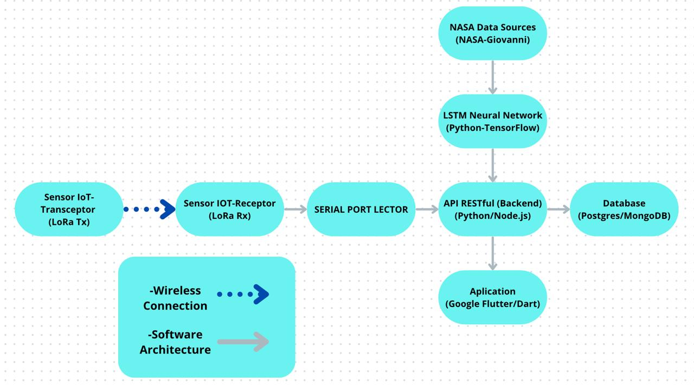

# AgroSat Solutions 🌾

AgroSat Solutions is an innovative project aimed at improving agricultural productivity by providing real-time predictions on irrigation needs and extreme weather events using LSTM neural networks, IoT sensors, and NASA's satellite datasets. The solution integrates cutting-edge AI models, real-time data collection, and a mobile app interface to help farmers make informed, data-driven decisions on water resource management.

## High-Level Summary

AgroSat Solutions combines Long Short-Term Memory (LSTM) neural networks, real-time IoT data, and NASA's Earth observation datasets to predict irrigation requirements and assess potential weather impacts on agriculture. By analyzing data from NASA’s **IMERG** and **NLDAS Noah** systems, processed via the **Giovanni platform**, AgroSat provides accurate, localized forecasts and irrigation suggestions.

### Key Achievements
- **LSTM Neural Networks** for time-series analysis of climate data.
- Integration of **IoT Sensors** for real-time, location-based forecasts.
- Use of **NASA Giovanni datasets** to enhance predictions.
- Development of a **Flutter-based mobile app** to present farmers with actionable insights.

## Demo

Check out the project demo [here]([https://drive.google.com/file/d/1xgwR0FhPydYmLJ1oJNUj8OaqL5z5eikP/view?usp=drive_link](https://drive.google.com/file/d/1xgwR0FhPydYmLJ1oJNUj8OaqL5z5eikP/view?usp=drive_link)).

## Features
- **Real-time IoT Data Collection**: Sensors gather soil moisture, temperature, and GPS data using LoRa technology.
- **Precipitation Predictions**: Use data from NASA to predict rainfall patterns.
- **Soil Moisture Forecasting**: Analysis of historical and real-time soil moisture content.
- **Mobile App**: A user-friendly app to display predictions and KPIs, designed to help farmers manage water resources efficiently.
- **Data-Driven Recommendations**: Suggestions on irrigation schedules and water usage based on AI-driven predictions.

## Technologies Used

- **Frontend**: Google Flutter (Dart)
- **Backend**: Python/Node.js (REST API)
- **Machine Learning**: TensorFlow, LSTM Neural Networks
- **Database**: PostgreSQL/MongoDB
- **IoT**: TTGO LoRa 32 modules, DHT22 sensors, GPS
- **Hardware Simulation**: Proteus, LM311 operational amplifiers

## Installation

### Prerequisites
- [Flutter SDK](https://flutter.dev/docs/get-started/install)
- [Python 3.x](https://www.python.org/downloads/)
- [Node.js](https://nodejs.org/en/download/)
- [TensorFlow](https://www.tensorflow.org/install)
- [PostgreSQL](https://www.postgresql.org/download/)
